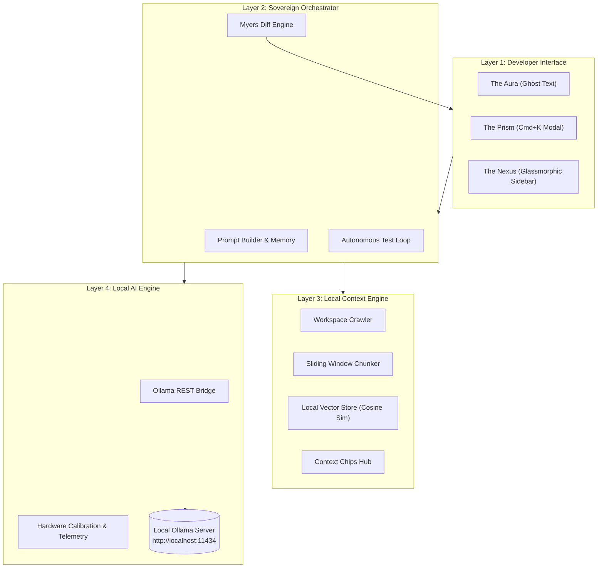

<div align="center">


# 🌌 Lumina: Autonomous AI Coding Agent for VS Code

**Illuminating the Path from Idea to Implementation through Local Intelligence & Complete Data Sovereignty.**

[](https://www.typescriptlang.org/)
[](https://code.visualstudio.com/)
[](https://ollama.com/)
[](#-zero-leak-data-sovereignty)
[](https://github.com/Garvit-821/Lumina)
[](LICENSE)

[**Features**](#-key-features) • [**Architecture**](#-system-architecture) • [**Quickstart**](#-quickstart-guide) • [**Hardware Profiles**](#-hardware-calibration--model-matrix) • [**Commands & Shortcuts**](#-keyboard-shortcuts--commands) • [**Contributing**](#-contributing)

</div>

---

## 📖 Table of Contents

- [Executive Summary](#-executive-summary)
- [Zero-Leak Data Sovereignty](#-zero-leak-data-sovereignty)
- [Key Features](#-key-features)
  - [1. The Nexus (Glassmorphic Sidebar)](#1-the-nexus-glassmorphic-sidebar)
  - [2. The Prism (Floating Command Bar - Cmd+K)](#2-the-prism-floating-command-bar---cmdk--ctrlk)
  - [3. The Aura (Ghost Text Autocomplete)](#3-the-aura-ghost-text-autocomplete)
  - [4. The Calibration Engine (Hardware Telemetry)](#4-the-calibration-engine-hardware-telemetry)
  - [5. The Context Engine (Local RAG)](#5-the-context-engine-local-rag)
  - [6. The Diff Engine (Selective Merging)](#6-the-diff-engine-selective-merging)
  - [7. The Autonomous Loop (Self-Healing Tests)](#7-the-autonomous-loop-self-healing-tests)
- [System Architecture](#-system-architecture)
- [Hardware Calibration & Model Matrix](#-hardware-calibration--model-matrix)
- [Prerequisites](#-prerequisites)
- [Installation & Setup](#-installation--setup)
- [Quickstart Guide](#-quickstart-guide)
- [Configuration Reference](#-configuration-reference)
- [Keyboard Shortcuts & Commands](#-keyboard-shortcuts--commands)
- [Repository Structure](#-repository-structure)
- [Development & Testing](#-development--testing)
- [Troubleshooting & FAQ](#-troubleshooting--faq)
- [Contributing](#-contributing)
- [License](#-license)

---

## 🌟 Executive Summary

**Lumina** is a professional-grade, privacy-first VS Code extension designed to transform your editor into an autonomous AI coding environment powered entirely by local models via **Ollama**.

Unlike conventional AI plugins that act as simple cloud-dependent chatbots, Lumina functions as an **autonomous agent**:
- It scans your physical system hardware (Apple Silicon Metal Unified Memory, NVIDIA CUDA, System RAM) to auto-tune parameters and eliminate system stutter.
- It indexes your entire local workspace into a local vector database for deep cross-file comprehension.
- It writes, refactors, tests, and merges code diffs directly within your source files with fine-grained developer approval.

---

## 🔒 Zero-Leak Data Sovereignty

Your codebase is your intellectual property. Lumina is engineered from the ground up on three strict privacy axioms:

1. **Air-Gapped Operation:** All inference, embeddings, and context retrieval occur locally via `http://localhost:11434`. No external API calls are made.
2. **Zero Telemetry:** No user prompts, file paths, keystrokes, or code snippets are transmitted to external servers.
3. **User-Controlled Agency:** Lumina never writes to your files without an explicit user trigger or approval via the **Diff Review Engine**.

---

## ✨ Key Features

### 1. The Nexus (Glassmorphic Sidebar)
The central intelligence hub embedded directly in the VS Code Activity Bar (`lumina.nexusView`):
- **Obsidian Glassmorphic UI:** Deep frosted acrylic containers (`backdrop-filter: blur(16px)`), responsive micro-animations, and vibrant glowing status indicators.
- **Context Chips Hub:** Real-time visual tags for active files and pinned context folders. Drag, drop, or click to toggle files in the AI's short-term memory.
- **Dynamic Model Switcher & Puller:** Switch between active local models on the fly and monitor running processes in VRAM.
- **Interactive Markdown Streamer:** Real-time streaming token renderer with syntax highlighting, 1-click **Copy**, **Apply to Editor**, and **Diff & Review** controls.

### 2. The Prism (Floating Command Bar - `Cmd+K` / `Ctrl+K`)
A lightweight, modal command bar for targeted in-place code transformations:
- Highlight any code block (or whole document) and press <kbd>Cmd</kbd>+<kbd>K</kbd> (macOS) or <kbd>Ctrl</kbd>+<kbd>K</kbd> (Windows/Linux).
- Choose from preset actions (*Refactor Selection*, *Generate Unit Tests*, *Fix Diagnostics*, *Add Strict Types*, *Optimize Performance*) or type a custom natural language instruction.
- Automatically launches a side-by-side diff comparison view for review.

### 3. The Aura (Ghost Text Autocomplete)
Low-latency inline code autocomplete powered by Fill-In-The-Middle (FIM) prompt engineering:
- Context-aware suggestions appear in grayed-out ghost text as you type.
- Press <kbd>Tab</kbd> to accept full completion.
- Built-in adaptive debouncing and cancellation token management to preserve local inference resources.

### 4. The Calibration Engine (Hardware Telemetry)
Hardware-aware intelligence that prevents system crashes:
- Queries OS hardware: CPU cores, total/free RAM, GPU architecture, Apple Metal unified memory, and NVIDIA VRAM.
- Automatically classifies host capacity into **Low**, **Balanced**, or **Power** profile tiers.
- Integrated **TPS Benchmark Runner**: Measures tokens-per-second and time-to-first-token (TTFT) against your active Ollama model.

### 5. The Context Engine (Local RAG)
Local semantic retrieval across your entire repository:
- Non-blocking workspace scanner that respects `.gitignore` and ignores binary assets / build directories.
- Sliding window code chunker with file path, language, and line range annotations.
- Zero-dependency local vector store utilizing **Cosine Similarity** with disk caching (`.lumina/vector_cache.json`).

### 6. The Diff Engine (Selective Merging)
Full developer control over code modifications:
- High-precision Myers/LCS diff algorithm producing structured line-by-line hunks.
- Opens side-by-side comparison view using native VS Code diffing (`lumina-diff://`).
- **Granular Actions:**
  - `Accept All`: Merges all proposed hunks atomically.
  - `Selective Accept`: Merge individual hunks or lines.
  - `Reject`: Discards the proposal with zero filesystem trace.

### 7. The Autonomous Loop (Self-Healing Tests)
An iterative agent workflow for continuous bug fixes:
1. Executes your local test runner or compiler (e.g. `npm test`, `pytest`, `cargo test`, `tsc`).
2. Captures stdout/stderr and error stack traces.
3. Diagnoses the root failure cause with Ollama.
4. Synthesizes a patch and applies it to source code.
5. Re-runs the test suite to verify resolution.

---

## 📐 System Architecture



---

## 💻 Hardware Calibration & Model Matrix

Lumina intelligently maps your detected hardware to recommended local open-source models:

| Profile Tier | Hardware Specification | Recommended Models | Embedding Model | Context Window |
| :--- | :--- | :--- | :--- | :--- |
| **Low Profile** | < 12 GB RAM<br>Integrated Graphics | `qwen2.5-coder:1.5b`<br>`phi3:mini`<br>`tinyllama` | `all-minilm:latest` | 4,096 tokens |
| **Balanced Profile** | 12–24 GB RAM<br>6–12 GB VRAM / M1–M3 | `qwen2.5-coder:7b`<br>`llama3.1:8b`<br>`mistral:7b` | `nomic-embed-text:latest` | 8,192 tokens |
| **Power Profile** | 24+ GB Unified RAM<br>16+ GB VRAM / M-Max | `deepseek-coder-v2:latest`<br>`qwen2.5-coder:14b`<br>`codeqwen:latest` | `nomic-embed-text:latest` | 16,384 tokens |

---

## 📦 Prerequisites

1. **VS Code**: Version `1.80.0` or later.
2. **Node.js**: Version `18.0.0` or later (Node v20+ recommended).
3. **Ollama**: Installed and running locally.
   - Install from [ollama.com](https://ollama.com/)
   - Verify server is active:
     ```bash
     curl http://localhost:11434/api/tags
     ```

---

## 🚀 Installation & Setup

### Option 1: Run in Development Mode

```bash
# 1. Clone the repository
git clone https://github.com/Garvit-821/Lumina.git
cd Lumina

# 2. Install dependencies
npm install

# 3. Build the extension bundle
npm run build

# 4. Open in VS Code
code .
```

Press <kbd>F5</kbd> in VS Code to launch the **Extension Development Host**.

### Option 2: Package & Install `.vsix`

```bash
# Install VS Code extension packaging tool
npm install -g @vscode/vsce

# Package Lumina
vsce package

# Install into your local VS Code
code --install-extension lumina-ai-agent-0.1.0.vsix
```

---

## ⚡ Quickstart Guide

### 1. Pull Your Preferred Local Model
```bash
# Recommended for balanced setups:
ollama pull qwen2.5-coder:7b

# Recommended for local embeddings (RAG):
ollama pull nomic-embed-text
```

### 2. Launch Nexus & Calibrate
1. Click the **Lumina Sparkle Icon** in the VS Code Activity Bar.
2. Navigate to the **Hardware** tab and click **Rescan Hardware**.
3. Click **Benchmark Model (TPS)** to measure your local token generation speed.

### 3. Use Prism for Fast Code Editing
1. Select a block of code in any editor.
2. Press <kbd>Cmd</kbd>+<kbd>K</kbd> (macOS) or <kbd>Ctrl</kbd>+<kbd>K</kbd> (Windows/Linux).
3. Select an action (e.g. *Refactor & Clean Code*) or enter your prompt.
4. Review the generated changes in the side-by-side diff window and click **Accept All** or **Reject**.

### 4. Index Workspace for Deep Context (RAG)
1. In the Nexus sidebar, open the **Context Hub** tab.
2. Click **Index Workspace Now**.
3. All code files are indexed into your private local vector store.

---

## ⚙️ Configuration Reference

Customize Lumina through VS Code Settings (`settings.json`):

```json
{
  // URL of your local Ollama server
  "lumina.ollamaEndpoint": "http://localhost:11434",

  // Selected primary coding model (e.g., qwen2.5-coder:7b, llama3.1:8b)
  "lumina.selectedModel": "qwen2.5-coder:7b",

  // Model used for vector embeddings
  "lumina.embeddingModel": "nomic-embed-text",

  // Enable/disable Aura Ghost Text inline autocomplete
  "lumina.enableGhostText": true,

  // Debounce delay in milliseconds for ghost text
  "lumina.ghostTextDelay": 350,

  // Sampling temperature for code generation (0.0 - 1.0)
  "lumina.temperature": 0.2,

  // Automatically scan hardware on startup
  "lumina.autoCalibrateOnStartup": true,

  // Maximum number of RAG chunks to inject into context
  "lumina.maxRagChunks": 5
}
```

---

## ⌨️ Keyboard Shortcuts & Commands

| Command | Shortcut | Description |
| :--- | :--- | :--- |
| `lumina.prism` | <kbd>Cmd</kbd>+<kbd>K</kbd> / <kbd>Ctrl</kbd>+<kbd>K</kbd> | Open floating Prism command bar for selected code |
| `lumina.calibrate` | Command Palette | Run hardware telemetry and model recommendation |
| `lumina.benchmark` | Command Palette | Benchmark active model inference speed (tokens/sec) |
| `lumina.indexWorkspace`| Command Palette | Index codebase files for local RAG |
| `lumina.toggleGhostText`| Command Palette | Enable/disable Aura Ghost Text autocomplete |
| `lumina.runAutonomousLoop`| Command Palette | Start autonomous test runner & auto-patch loop |
| `lumina.focusNexus` | Command Palette | Reveal Nexus Sidebar Hub |
| `lumina.openSettings` | Command Palette | Open Lumina configuration settings |

---

## 📂 Repository Structure

```
lumina/
├── .vscode/               # VS Code launch and task configs
├── resources/             # Extension icons and visual assets
│   └── lumina-icon.svg
├── src/
│   ├── aura/              # The Aura (Ghost Text inline completion)
│   │   └── inlineCompletion.ts
│   ├── calibration/       # Hardware Telemetry & Recommender
│   │   ├── telemetry.ts
│   │   ├── recommender.ts
│   │   └── benchmarker.ts
│   ├── diff/              # Myers Diff Engine & Comparison Provider
│   │   ├── diffEngine.ts
│   │   ├── diffProvider.ts
│   │   └── patchManager.ts
│   ├── nexus/             # The Nexus (Glassmorphic Sidebar Webview)
│   │   ├── nexusViewProvider.ts
│   │   └── media/
│   │       ├── nexus.html
│   │       ├── nexus.css
│   │       └── nexus.js
│   ├── ollama/            # Local Ollama REST Client & Manager
│   │   ├── client.ts
│   │   └── manager.ts
│   ├── orchestrator/      # Sovereign Orchestrator & Autonomous Loop
│   │   ├── promptBuilder.ts
│   │   ├── sovereignOrchestrator.ts
│   │   └── autonomousLoop.ts
│   ├── prism/             # The Prism (Cmd+K Floating Command Bar)
│   │   └── floatingCommandBar.ts
│   ├── rag/               # Local Context Engine & Vector Store
│   │   ├── crawler.ts
│   │   ├── chunker.ts
│   │   ├── vectorStore.ts
│   │   └── contextEngine.ts
│   ├── utils/             # OutputChannel logger & StatusBar
│   │   ├── logger.ts
│   │   └── statusBar.ts
│   ├── extension.ts       # Main extension activation entry point
│   └── types.ts           # Core TypeScript types & message protocols
├── test/
│   └── test-suite.js      # Unit and integration test suite
├── Documentation.md       # Original specification & whitepaper
├── esbuild.js             # Asset packaging pipeline
├── package.json           # Extension manifest & contribution points
├── tsconfig.json          # TypeScript compiler configuration
└── readme.md              # Project documentation
```

---

## 🛠️ Development & Testing

### Building
```bash
# Typecheck TypeScript source
npm run typecheck

# Bundle extension with esbuild
npm run build

# Watch mode for active development
npm run build:watch
```

### Running Tests
Lumina includes a standalone verification suite covering the Diff Engine, Code Chunker, Model Recommender, and Cosine Similarity math:
```bash
npm run compile
node test/test-suite.js
```

---

## ❓ Troubleshooting & FAQ

<details>
<summary><strong>Q: Lumina displays "Ollama: Offline" in the status bar.</strong></summary>

1. Ensure the Ollama daemon is running in your terminal:
   ```bash
   ollama serve
   ```
2. Verify that the URL in `lumina.ollamaEndpoint` matches your Ollama instance (`http://localhost:11434` by default).
</details>

<details>
<summary><strong>Q: How do I speed up inline ghost text completions?</strong></summary>

- Pull a smaller, highly optimized model such as `qwen2.5-coder:1.5b` or `phi3:mini`.
- In settings, reduce `lumina.ghostTextDelay` to `200`.
</details>

<details>
<summary><strong>Q: Does Lumina require an internet connection?</strong></summary>

No. Once your models are pulled via Ollama, Lumina functions **100% offline and air-gapped**.
</details>

---

## 🤝 Contributing

Contributions are warmly welcomed! To contribute:

1. **Fork the Repository** on GitHub.
2. **Create a Feature Branch**: `git checkout -b feature/amazing-feature`
3. **Commit Your Changes**: `git commit -m "feat: add amazing feature"`
4. **Push to the Branch**: `git push origin feature/amazing-feature`
5. **Open a Pull Request**.

Please ensure all tests pass with `node test/test-suite.js` before submitting.

---

## 📄 License

This project is licensed under the **MIT License** - see the [LICENSE](LICENSE) file for details.

---

<div align="center">
  <sub>Built with ❤️ for the Local AI & Open Source Community.</sub>
</div>